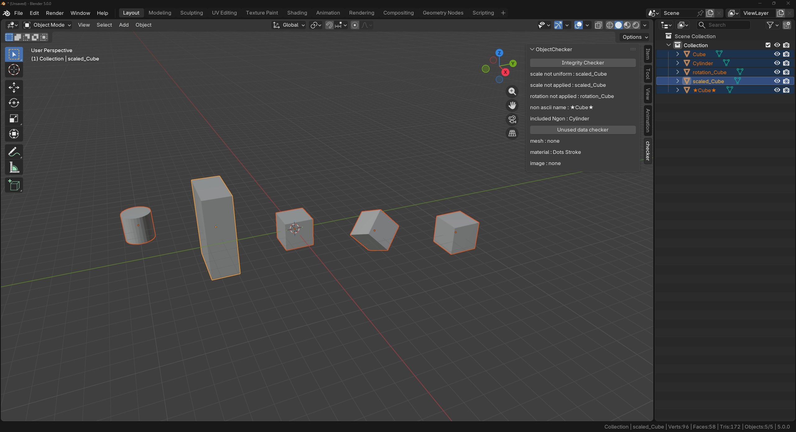

# Data Integrity Checker

A Blender add-on that checks the state of selected objects and finds unused data.

## Features

### Object Check

Checks multiple selected objects at once and lists the names of the objects that were flagged, grouped by category:

- Non-uniform scale (the scale differs between axes)
- Unapplied scale (the scale is not 1.0 on every axis)
- Unapplied rotation
- Non-ASCII name
- Mesh containing n-gons

### Unused Data Check

Finds unused meshes, materials and images in the current file.

## Installation

1. Download the latest `data_integrity_checker.zip`
2. In Blender, go to `Edit` > `Preferences` > `Get Extensions`
3. Click the arrow button in the top right and choose `Install from Disk...`
4. Select the downloaded zip file

Requires Blender 5.0 or later.

## Usage

Open the sidebar in the 3D Viewport (press `N`) and go to the `checker` tab.

### Object Check

1. Select the objects you want to check
2. Click `Integrity Checker`

### Unused Data Check

1. Click `Unused Data Checker`

No selection is required.

## Behavior

- Object Check only processes selected objects.
- Rotation is not detected on objects whose rotation mode is set to Quaternion.
- Unused Data Check also reports materials that Blender generates automatically on startup, such as `Dots Stroke`. These are genuinely unused, so they are reported as expected.

## License

GPL-2.0-or-later